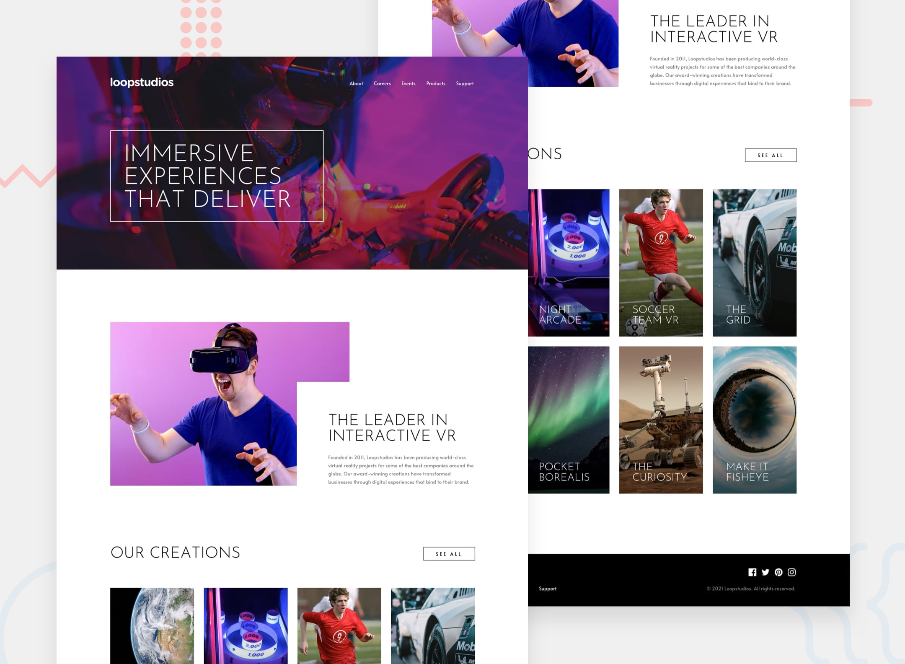

<div align="center">

# 🎮 Loopstudios Landing Page

[](https://anaclarissi.github.io/loopstudios-landing-page/)
[](https://developer.mozilla.org/en-US/docs/Web/HTML)
[](https://developer.mozilla.org/en-US/docs/Web/CSS)
[](https://developer.mozilla.org/en-US/docs/Web/JavaScript)
[](https://getbootstrap.com/)

Solução para o desafio **Loopstudios Landing Page** do [Frontend Mentor](https://www.frontendmentor.io/challenges/loopstudios-landing-page-N88J5Onjw).

### 🔗 [Ver Preview ao Vivo →](https://anaclarissi.github.io/loopstudios-landing-page/)

</div>

---

## 📸 Screenshot

<div align="center">

> Acesse o site para ver a experiência completa em desktop e mobile.



[](https://anaclarissi.github.io/loopstudios-landing-page/)

</div>

---

## 🛠️ Tecnologias Utilizadas

| Tecnologia | Uso |
|---|---|
| **HTML5** | Estrutura semântica da página |
| **CSS3** | Estilização customizada e responsividade |
| **JavaScript** | Interatividade e troca de imagens dinâmica |
| **Bootstrap 5.3** | Grid, Navbar e componentes de layout |
| **Font Awesome 7** | Ícones sociais e de menu |
| **Google Fonts** | Tipografia (Alata + Josefin Sans) |

---

## ✨ Pontos Fortes do Projeto

**Responsividade cuidadosa** — O layout adapta-se fluidamente entre mobile e desktop, com imagens, tipografia e grid ajustados para cada breakpoint. As imagens das criações são trocadas dinamicamente via JavaScript (`showImages()`), servindo a versão mobile ou desktop conforme a largura da tela.

**Menu mobile bem executado** — O estado aberto do menu utiliza a pseudo-classe `:has()` do CSS para alterar a aparência do header sem JavaScript extra, escondendo o hero e exibindo o ícone correto (hambúrguer / X) de forma elegante.

**Acessibilidade presente** — As `<nav>` possuem `aria-label` descritivos, os ícones de redes sociais têm `aria-label` para leitores de tela, e os atributos semânticos do HTML foram utilizados corretamente (`<header>`, `<main>`, `<footer>`, `<section>`).

**Efeitos de hover refinados** — Os cards de criações possuem overlay suave ao passar o mouse, e os links de navegação contam com animação de underline usando `::after`, fiel ao design do desafio.

**CSS com variáveis bem organizadas** — O uso de `custom properties` (`:root`) centraliza cores e fontes, facilitando manutenção e futuros ajustes de tema.

**Código limpo e separado** — HTML, CSS e JavaScript estão em arquivos distintos, com seções bem comentadas no CSS, tornando o projeto fácil de ler e escalar.

---

## 🚀 Melhorias Futuras

**Implementar imagens responsivas com `<picture>`** — Atualmente a troca entre imagens mobile/desktop é feita via JavaScript. Usar o elemento `<picture>` nativo com `srcset` seria mais performático, carregando apenas a imagem necessária para cada viewport sem JavaScript.

**Animação de entrada das seções** — Adicionar `IntersectionObserver` para revelar os cards e seções com fade-in suave ao rolar a página, enriquecendo a experiência visual.

**Acessibilidade do menu mobile** — Gerenciar o foco (`focus trap`) quando o menu estiver aberto e fechar com a tecla `Escape`, seguindo as melhores práticas de ARIA para menus de navegação.

**Otimização de imagens** — Converter as imagens para o formato WebP para reduzir o peso da página e melhorar a pontuação no Lighthouse.

**Estado ativo nos links de navegação** — Adicionar destaque visual ao link da seção atual conforme o usuário navega, usando `IntersectionObserver` ou scroll events.

**Deploy com CI/CD** — Configurar GitHub Actions para deploy automático, garantindo que cada push na branch principal atualize o site em produção sem passos manuais.

---

## 📁 Estrutura do Projeto

```
loopstudios-landing-page/
├── index.html
└── src/
    ├── css/
    │   └── style.css
    ├── js/
    │   └── script.js
    └── images/
        ├── desktop/
        ├── mobile/
        └── favicon-32x32.png
```

---

## 👩‍💻 Autora

<div align="center">

**Ana Clarissi**

[](https://www.frontendmentor.io/profile/anaClarissi)
[](https://github.com/anaClarissi)

</div>

---

## 📄 Desafio

Este projeto é uma solução para o desafio [Loopstudios Landing Page](https://www.frontendmentor.io/challenges/loopstudios-landing-page-N88J5Onjw) do Frontend Mentor. Os desafios do Frontend Mentor ajudam a praticar habilidades de desenvolvimento front-end construindo projetos realistas.

<div align="center">

---

*Feito com 💙 por Ana Clarissi*

</div>